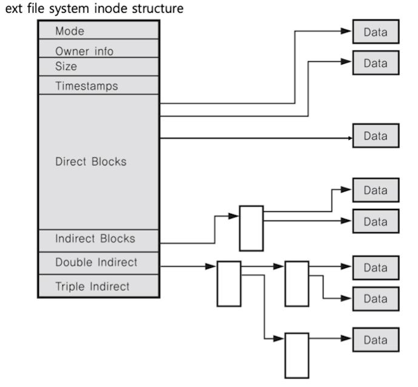

# 운영체제
## 운영체제 구조
- 컴퓨터 하드웨어와 응용프로그램을 관리
### 사용자 인터페이스 제공
- 쉘(Shell)
    - 사용자가 운영체제 기능과 서비스를 조작할 수 있도록 인터페이스를 제공하는 프로그램
    - 쉘은 터미널환경(CLI)과 GUI환경 두종류로 분류
- 응용프로그램
    - 운영체제가 제공하는 API 라이브러리로 운영체제에게 기능과 서비스를 요청
### 응용프로그램을 위한 인터페이스 제공
- 운영체젝 기능을 사용하기 위한 API or Library 제공
- 시스템 콜
    - 운영체제의 기능을 호출하는 함수
    - 운영체제가 운영체제 각 기능을 사용할 수 있도록 시스템 콜이라는 명령 또는 함수를 제공
    - 각 운영체제가 제공하는 API 내부에는 시스템콜을 호출하는 형태
    - 대부분의 시스템콜은 POSIX API(유닉스계열) 기반


</img>
#### 운영체제를 만든다면?
1. 운영체제의 핵심 기능 개발 (Kernel)
2. 시스템 콜을 개발
3. 각 언어별 API 개발
4. API를 이용해 Shell 프로그램 개발
5. 응용 프로그램 개발

### CPU Protection Rings
- 응용프로그램이 함부로 전체 컴퓨터 시스템을 해치지 못하도록 바지
#### 사용자모드와 커널모드
- 사용자 모드 (user mode): 응용프로그램이 사용
- 커널 모드(kernel mode): 특정 명령어 실행과 원하는 작업 수행을 위한 자원접근을 가능하게 하는 모드. OS가 사용

</img>
#### 응용프로그램과 운영체제
- 시스템 콜은 커널 모드로 실행
- 커널 모드로 실행하려면 반드시 시스템 콜을 사용해야함
- 시스템 콜은 운영체제가 제공

</img>

<hr>

## 프로세스 스케쥴링
### 시분할 시스템
- 응용프로그램이 CPU를 점유하는 시간을 잘게 쪼개어 실행될 수 있도록 하는 시스템
- 다중 사용자 지원을 위해 컴퓨터 응답 시간을 최소화하는 시스템
### 멀티 태스킹
- 단일 CPU에서 여러 응용 프로그램이 동시에 실행되는 것처럼 보이도록 하는 시스템
### 멀티 태스킹과 멀티 프로세싱
- 멀티 태스킹: 단일 CPU
- 멀티 프로세싱: 여러 CPU에서 하나의 프로그램을 병렬로 실행해서 실행속도를 극대화시키는 시스템

</img>

### 멀티 프로그래밍
- CPU 활용도를 극대화하는 스케쥴링 알고리즘

<hr>

## 프로세스와 스케쥴링의 이해 
### 프로세스 (process) 란?
- 메모리에 올려져서 실행 중인 프로그램
- 코드 이미지(바이너리): 실행 파일
> 프로세스라는 용어는 작업, task, jop이라는 용어와 혼용
- 응용 프로그램 != 프로세스
    - 응용 프로그램은 여러개의 프로세스로 이루어질 수 있음
    - 하나의 응용 프로그램은 여러 개의 프로세스(프로그램)가 상호작용을 하면서 실행될 수도 있음
### 스케쥴링 기본 알고리즘
#### FIFO 스케쥴러
- 가장 간단한 스케쥴러 (배치 처리 시스템)
- FCFS (First Come First Served) 스케쥴러
- 먼저 들어온 프로세스 부터 처리한다.

</img>

#### 최단 작업 우선 (SJF) 스케쥴러
- SJF (Shortest Jop First) 스케쥴러
- 프로세스 실행시간이 가장 짧은 프로세스부터 먼저 실행
- 단점: 프로세스의 실행시간을 모두 알아야함
#### 우선순위 기반 스케쥴러
- Priority-Based 스케쥴러
    - 정적 우선순위 기반
        - 프로세스마다 우선순위를 미리 지정
    - 동적 우선순위 기반
        - 스케쥴러가 상황에 따라서 우선순위를 동적으로 변경
#### Round Robin 스케쥴러
- 시분할 시스템 기반

</img>

### 프로세스 상태와 스케쥴러
#### 프로세스 상태
- running state: 현재 CPU에서 실행 상태
- ready state: CPU에서 실행 가능 상태 (실행 대기 상태)
- block state: 특정 이벤트 발생 대기 상태 (예: 프린팅이 다 되었는지)

</img>

#### 프로세스 상태 기반 스케쥴링 알고리즘
- 프로세스의 상태에 따라 프로세스를 Queue에 담아 실행가능 상태의 프로세스를 실행해주는 알고리즘 
    - Ready State Queue
    - Running State Queue
    - Block State Queue

### 스케쥴링 알고리즘
#### 선점형과 비선점형 스케쥴러 
- 선점형 스케쥴러: 하나의 프로세스가 다른 프로세스 대신에 프로세서(CPU)를 차지할 수 있음
- 비선점형 스케쥴러: 하나의 프로세스가 끝나지 않으면 다른 프로세스는 CPU를 사용할 수 없음

#### 선점형과 비선점형 스케쥴러의 차이
- 선전형: 프로세스 running 중에 스케쥴러가 이를 중단시키고, 다른 프로세스로 교체 가능
- 비선점형: 프로세스가 자발적으로 blocking 상태로 들어가거나, 실행이 끝나을 때만 다른 프로세스로 교체 가능

#### 스케쥴러 구분
- FIFO(FCFS), SJF, Priority-based는 어떤 프로세스를 먼저 실행시킬지에 대한 알고리즘
- Round Robin은 시분할 시스템을 위한 기본 알고리즘 (선점형 스케쥴러)

### 인터럽트
#### 인터럽트란?
- CPU가 프로그램을 실행하고 있을 때 입출력 하드웨어 등의 장치나 예외상황이 발생하여 처리가 필요할 경우에 CPU에 알려서 처리하는 기술

#### 인터럽트가 필요한 이유
- 선점형 스케쥴러 구현
    - 프로세스 running중에 스케쥴러가 이를 중단시키고, 다른 프로세스로 교체하기 위해 현재 프로세스 실행을 중단시킴
        - 그러려면, 스케쥴러 코드가 실행이 되서 현 프로세스 실행을 중지시켜야함
- IO Device와의 커뮤니케이션
    - 저장매체에서 데이터 처리 완료시, 프로세스를 깨워야함 (block state -> ready state)

</img>

- 예외 상황 핸들링
    - CPU가 프로그램을 실행하고 있을 때, 입출력 하드웨어 등의 장치나 예외상황이 발생한 경우 CPU가 해당 처리를 할 수 있도록 CPU에 알려줘야함

#### 이벤트와 인터럽트
- 인터럽트는 일종의 이벤트로 불림
- 이벤트에 맞게 운영체제가 처리

#### 인터럽트 종류
- 내부 인터럽트 (소프트웨어 인터럽트)
    - 주로 프로그램 내부에서 잘못된 명령 또는 잘못된 데이터 사용시 발생
        - 0으로 나눴을 때
        - 사용자 모드에서 허용되지 않은 명령 또는 공간 접근 시
        - 계산 결과가 Overflow/Underflow 날 때
- 외부 인터럽트 (하드웨어 인터럽트)
    - 주로 하드웨어에서 발생되는 이벤트 (프로그램 외부)
        - 전원 이상
        - 기계 문제
        - 키보드등 IO 관련 이벤트
        - Timer 이벤트

#### 시스템 콜 인터럽트
- 시스템콜을 실행하기 위해서는 강제로 코드에 인터럽트 명령을 넣어 CPU가 실행하도록 해야함.
- 시스템 콜 실제 코드
    - 시스템콜 함수는 각각의 번호가 지정되어있음
    - eax 레지스터에 시스템콜 번호를 넣고
    - ebx 레스터에는 시스템콜에 해당하는 인자값을 넣고
    - 소프트웨어 인터럽트 명령을 호출하면서 0x80(인텔사의 시스템콜 인터럽트 번호)값을 넘겨줌
```c
mov eax, 1
mov ebx, 0
int 0x80    // 소프트웨어 인터럽트 명령
```

#### 인터럽트와 시스템콜
- 시스템콜 인터럽트 명령을 호출하면서 0x80값(op code)을 넘겨줌
    - CPU는 사용자 모드를 커널 모드로 바꿔줌
    - IDT(Interrupt Descriptor Table) 에서 0x80에 해당하는 주소(함수)를 찾아서 실행함
    - system_call() 함수에서 eax로부터 시스템콜 번호를 찾아서 해당 번호에 맞는 시스템콜 함수로 이동
    - 해당 시스템콜 함수 실행 후, 다시 커널모드에서 사용자모드로 변경하고 해당 프로세스 다음 코드 진행

</img>

#### 인터럽트와 IDT
- 인터럽트는 미리 정의되어 각각 번호와 실행코드를 가리키는 주소가 기록되어 있음
    - 어디에? IDT(Interrupt Descriptor Table)에 기록
    - 언제? 컴퓨터 부팅시 운영체제가 기록
    - 어떤 코드? 운영체제 내부 코드

### 프로세스와 컨텍스트 스위칭
#### 프로세스 구조
- text(CODE): 코드
- data: 변수/초기화된 데이터
- stack: 임시데이터(함수 호출, 로컬 변수등)
- heap: 코드에서 동적으로 만들어지는 데이터

</img>

#### 프로세스의 데이터 영역
- BSS와 DATA로 분리
    - BSS: 초기화되지 않은 전역변수
    - DATA: 초기값이 있는 전역변수

##### PCB (Process Control Block)
> Process Context Block이라고도 함
- 프로세스가 실행중인 상태를 캡쳐/구조화해서 저장
    1. Process ID
    2. Register 값 (PC, SP등)
    3. Scheduling Info (Process State: 프로세스 상태 관리)
    4. Memory Info (메모리 사이즈 limit)  
    ...

#### 컨텍스트 스위칭
- Context Switching (문맥교환)
    - CPU에서 실행할 프로세스를 교체하는 기술
1. 실행 중지할 프로세스 정보를 해당 프로세스의 PCB에 업데이트해서 메인메모리에 저장
2. 메인메모리에 있는 다음 실행할 프로세스 PCB 정보를 CPU의 레지스터에 넣고 실행

> 디스패치 (Dispatch): ready 상태의 프로세스를 running 상태로 바꾸는 것

</img>

### 프로세스간 커뮤니케이션
- InterProcess Communication(IPC)
    - 여러 프로세스 동시 실행을 통한 성능 개선, 복잡한 프로그램을 위해 프로세스간 통신 필요
    - 프로세스간 공간은 완전 분리 되어있다.
    - 프로세스간 통신을 위한 특별한 기법 IPC 등장

#### 다양한 IPC기법
1. file 사용
2. Message Queue
3. Shared Memory
4. Pipe
5. Signal
6. Semaphore
7. Socket  
...

> 2번부터의 IPC기법은 커널공간을 활용 - 커널 공간은 공유하기 때문

#### 파이프 (pipe)
- 기본 파이프는 단방향 통신
- fork()로 자식 프로세스를 만들었을 때, 부모와 자식간의 통신

</img>

- 파이프 코드 예제
```c
char* msg = "Hellow Child Process!";
int main()
{
    char buf[255];
    int fd[2], pid, nbytes;
    
    if(pipe(fd) < 0) // pipe(fd)로 파이프 생성 fd에는 부모와 자식프로세스의 주소 저장
        exit(1);
    
    pid = fork(); // 이 함수 실행 다음 코드부터 부모/자식 프로세스로 나뉘어짐
    if(pid > 0){ // 부모 프로세스는 pid에 실제 프로세스 ID가 들어감
        write(fd[1], msg, MSGSIZE); // fd[1]에 씀
        exit(0);
    }
    else{
        nbytes = read(fd[0], buf, MSGSIZE); // fd[0]으로 읽음
        printf("%d %s\n", nbytes, buf);
        exit(0);
    }

    return 0;
}
```
#### message queue
- 기본은 FIFO 정책으로 데이터 전송

</img>

- 메시지큐 코드 예제
```c
// A 프로세스
msqid = msgget(key, msgflg); // key는 1234, msgflg는 옵션
msgsnd(msqid, &sbuf, buf_length, IPC_NOWAIT);
```
```c
// B 프로세스
msqid = msgget(key, msgflg); // key는 동일하게 1234로 해야 해당 큐의 msgid를 얻을 수 있음
msgrcv(msqid, &rbuf, MSGSZ, 1, 0);
```

#### 파이프와 메시지큐
- message queue는 부모/자식이 아니라, 어느 프로세스간에라도 데이터 송수신이 가능
- 먼저 넣은 데이터가 먼저 읽힘

#### pipe vs message queue
- pipe는 부모/자식 only, message queue는 not
- 단방향만 가능, 양방향 가능

#### IPC 기법과 커널모드
- pipe, message queue 모두 kernel 공간의 메모리를 사용
    - 메모리 공간도 kernel/ user로 구분된다.

</img>

#### 공유 메모리 (shared memory)
- 노골적으로 kernel space에 메모리 공간을 만들고, 해당 공간을 변수처럼 쓰는 방식
- message queue처럼 FIFO 방식이 아니라, 해당 메모리 주소를 마치 변수처럼 접근하는 방식
- 공유메모리 key를 가지고 여러 프로세스가 접근 가능

</img>

- 공유 메모리 코드 예제
1. 공유 메모리 생성 및 공유 메모리 주소 얻기
```c
shmid = shmget((key_t)1234, SIZE, (IPC_CREAT|0666));
shmaddr = shmat(shmid, (void*)0, 0);
```
2. 공유 메모리에 쓰기
```c
strcpy((char*)shmaddr, "Shared Memory");
```
3. 공유 메모리에서 읽기 
```c
printf("%s\n", (char*)shmaddr);
```

#### 시그널 (signal) - 이벤트
- 유닉스에서 30년 이상 사용된 전통적인 기법
- 커널 또는 프로세스에서 다른 프로세스에 어떤 이벤트가 발생되었는지를 알려주는 기법
- 프로세스 관련 코드에 관련 시그널 핸들러를 등록해서 해당 시그널 처리 실행
    1. 시그널 무시
    2. 시그널 블록(블록을 푸는 순간 프로세스에 해당 시그널 전달)
    3. 등록된 시그널 핸들러로 특정 동작 수행
    4. 등록된 시그널 핸들러가 없다면 커널에서 기본 동작 수행

- 시그널 관련 코드 예제
    - 시그널 핸들러 등록 및 핸들러 구현
    ```c
    static void signal_handler(int signo){
        printf("Catch SIGINT!\n");
        exit(EXIT_SUCCESS);
    }

    int main(void){
        if(signal(SIGINT, signal_handler) == SIG_ERR){
            printf("Can't catch SIGINT!\n");
            exit(EXIT_FAILURE);
        }

        for(;;)
            pause();
        return 0;
    }
    ```
    - 시그널 핸들러 무시
    ```c
    int main(void){
        if(signal(SIGINT, SIG_IGN) == SIG_ERR){
            printf("Can't catch SIGINT!\n");
            exit(EXIT_FAILURE);
        }

        for(;;)
            pause();
        return 0;
    }
    ```
#### 시그널과 프로세스
- PCB에 해당 프로세스가 블록 또는 처리해야하는 시그널 관련 정보 처리
- 컨텍스트 스위칭되는 과정에서 커널모드에서 사용자모드로 전환할 때 PCB의 signal 정보를 확인하여 관련 이벤트 처리

</img>

#### 소켓 (socket)과 IPC
- 소켓을 하나의 컴퓨터 안에서 두개의 프로세스간 통신 기법으로 사용 가능

</img>

<hr>

## 스레드의 이해
### Thread (스레드)
- Light Weight Process 라고도 함
- 프로세스
    - 프로세스 간에는 각 프로세스의 데이터 접근이 불가
- 스레드
    - 하나의 프로세스에 여러개의 스레드 생성 가능
    - 스레드들은 동시에 실행 가능
    - 프로세스 안에 있으므로 프로세스의 데이터를 모두 접근 가능

- 각기 실행이 가능한 stack 존재 (pc,sp도 따로 존재)
</img>

#### Multi Thread (멀티 스레드)
- 소프트웨어 병행 작업 처리를 위해 Multi Thread를 사용

</img>

#### Thread 장점
1. 사용자에 대한 응답성 향상
</img>

2. 자원 공유 효율
    - IPC 기법과 같이 프로세스간 자원 공유를 위해 번거로운 작업이 필요없음
    - 프로세스 안에 있으므로 프로세스의 데이터를 모두 접근 가능
3. 작업이 분리되어 코드가 간결
    - 사실 작성하기 나름

#### Thread 단점
1. 스레드 중 한 스레드만 문제가 있어도 전체 프로세스가 영향을 받음
    - 멀티 프로세스
    </img>
    - 멀티 스레드
    </img>
2. 스레드를 많이 생성하면 Context Switching이 많이 일어나기 때문에 성능이 저하된다.

#### Thread vs Process
- 프로세스는 독립적, 스레드는 프로세스의 서브셋
- 프로세스는 각각 독립적인 자원을 가짐, 스레드는 프로세스 자원 공유
- 프로세스는 자신만의 주소영역을 가짐, 스레드는 주소영역 공유
- 프로세스간에는 IPC기법으로 통신해야함, 스레드는 필요없음

### 동기화 (Synchronization) 이슈
- 동기화: 작업들 사이에 실행 시기를 맞추는 것
- 여러 스레드가 동일한 자원(데이터) 접근 시 동기화 이슈 발생
    - 동일 자원을 여러 스레드가 동시 수정시 각 스레드 결과에 영향을 줌

#### 동기화 이슈 예
- 덧셈을 한다는 가정하에 덧셈 레지스터는 공유해서 사용하기 때문에 context switching 과정에서 덧셈이 제대로 되지 않는 경우가 발생한다.
</img>

#### 동기화 이슈 해결 방안
- Mutual Exclusion (상호배제)
- 스레드는 프로세스의 모든 데이터에 접근할 수 있으므로
    - 여러 스레드가 변경하는 공유 변수에 대해 Exclusive Access 필요
    - 어느 한 스레드가 공유 변수를 갱신하는 동안 다른 스레드가 동시 접근하지 못하도록 함

#### Mutual Exclusion (상호배제)
- 임계자원 (critical resource)
- 임계영역 (critical section)
```c#
lock(obj){
    for(;;)
        count++;
}
```

#### Mutex와 세마포어 (Semaphore)
- Critical Section (임계구역)에 대한 접근을 막기 위해 LOCKING 메커니즘이 필요
    - Mutex (binary semaphore)
        - 임계구역에 하나의 스레드만 들어갈 수 있음
    - Semaphore
        - 임계구역에 여러 스레드가 들어갈 수 있음
        - counter를 두어 동시에 리소스에 접근할 수 있는 허용 가능한 스레드 수를 제어

#### 세마포어 (Semaphore)
- P: 검사 (임계영역에 들어갈 때)
    - S값이 1이상이면 임계영역 진입 후 S값 1차감 (S값이 0이면 대기)
- V: 증가 (임계영역에서 나올 때)
    - S값을 1더하고 임계영역을 나옴
- S: 세마포어 값 (초기 값만큼 여러 프로세스가 동시 임계 영역 접근 가능)

> 슈도코드 (Pseudo Code)

</img>

#### 세마포어 (Semaphore) - 바쁜 대기
- wait()는 S가 0이라면, 임계영역에 들어가기 위해 반복문 수행
    - loop를 돈다는 건 CPU를 사용한다는 의미이기 때문에 성능상에 문제로 이어짐
    - 바쁜대기, busy waiting

</img>

#### 세마포어 (Semaphore) - 대기큐
> 운영체제 기술로 보완 - 대기큐
- S가 음수일 경우 바쁜대기 대신 대기큐에 넣는다.
- 바쁜대기 해결책

</img>

#### 교착상태 (deadlock)
- 무한 대기 상태: 두개이상의 작업이 서로 상대방의 작업이 끝나기만을 기다리고 있기 때문에 다음 단계로 진행하지 못하는 상태

</img>

> 배치처리 시스템에서는 일어나지 않는 문제
프로세스, 스레드 둘다 이와 같은 상태가 일어날 수 있음

#### 교착상태 발생 조건
- 다음 네 가지 조건이 모두 성립될 때 교착상태 발생 가능성이 있음
1. 상호배제 (Mutual exclusion): 프로세스들이 필요로 하는 자원에 대해 배타적인 통제권을 요구한다.
2. 점유대기 (Hold and wait): 프로세스가 할당된 자원을 가진 상태에서 다른 자원을 기다린다.
3. 비선점 (No preemption): 프로세스가 어떤 자원의 사용을 끝낼 때까지 그 자원을 뺏을 수 없다.
4. 순환대기 (Circular wait): 각 프로세스는 순환적으로 다음 프로세스가 요구하는 자원 가지고 있다.

#### 교착상태 예방
- 4가지 조건 중 하나를 제거하는 방벙
1. 상호배제 조건의 제거: 임계 영역 제거
2. 점유와 대기 조건의 제거: 한번에 모든 필요 자원 점유 및 해제
3. 비선점 조건 제거: 선점 가능 기법을 만들어줌
4. 순환 대기 조건 제거: 자원 유형에 따라 순서를 매김

#### 교착상태 회피
- 교착상태 조건 1,2,3,4 중 4번만 제거
    - 1,2,3 제거시 프로세스 실행 비효율성이 증대
- 교착상태 조건 중 자원 할당 순서를 정의하지 않음(순환 대기 조건 제거)

#### 기아상태 (starvation)
- 특정 프로세스의 우선순위가 낮아서 원하는 자원을 계속 할당 받지 못하는 상태
- 교착상태와 기아상태
    - 교착상태는 여러 프로세스가 동일 자원 점유를 요청할 때 발생
    - 기아상태는 여러 프로세스가 부족한 자원을 점유하기 위해 경쟁할 때, 특정 프로세스는 영원히 자원할당이 안되는 경우를 주로 의미함

#### 기아상태 해결 방안
- 우선순위 변경
    - 프로세스 우선순위를 수시로 변경해서 각 프로세스가 높은 우선순위를 가질 기회주기
    - 오래 기다린 프로세스의 우선순위를 높혀주기
    - 우선순위가 아닌 요청 순서대로 처리하는 FIFO 기반 요청큐 사용

<hr>

## 가상 메모리의 이해
### 가상 메모리
- 메모리가 실제(물리) 메모리보다 많아 보이게 하는 기술
- 프로세스간 공간분리로 프로세스 이슈가 전체 시스템에 영향을 주지 않을 수 있음

</img>

#### 가상 메모리가 필요한 이유
- 하나의 프로세스만 실행 가능한 시스템 (배치처리 시스템등)
1. 프로그램을 메모리로 로드
2. 프로세스 실행
3. 프로세스 종료 (메모리 해제)
- 여러 프로세스 동시 실행 시스템
1. 메모리 용량 부족 이슈
2. 프로세스 메모리 영역간의 침범 이슈 

#### 가상 메모리 기본 아이디어
- 프로세스는 가상 주소를 사용하고, 실제 해당 주소에서 데이터를 읽고/쓸때만 물리 주소로 바꿔주면 된다
- virtual address(가상주소): 프로세스가 참조하는 주소
- physical address(물리주소): 실제 메모리 주소

#### MMU (Memory Management Unit)
- CPU에서 코드 실행 시 가상 주소 메모리 접근이 필요할 때, 해당 주소를 물리 주소값으로 변환해주는 하드웨어 장치

#### 가상 메모리와 MMU
- CPU는 가상 메모리를 다루고, 실제 해당 주소 접근 시 MMU 하드웨어 장치를 통해 물리 메모리 접근
    - 하드웨어 장치를 이용해야 주소 변환이 빠르기 때문에 별도 장치를 둠

</img>

### 페이징 시스템
- 페이징 (paging) 개념
    - 크기가 동일한 페이지로 가상 주소 공간과 이에 매칭하는 물리 주소 공간을 관리
    - 하드웨어 지원이 필요
        - 예) Inter x86 시스템(32bit)에서는 4KB, 2MB, 1GB 지원
    - 리눅스에서는 4KB로 paging
    - 페이지 번호를 기반으로 가상 주소/물리 주소 매핑 정보를 기록하고 사용

#### 실질적인 예
- 프로세스의 PCB에 Page Table 구조체를 가리키는 주소가 들어있음
- Page Table에는 가상주소와 물리주소간 매핑 정보가 있음

</img>

#### 페이징 시스템 구조
- page 또는 page frame: 고정된 크기의 block(4KB)
- paging system
    - 가상 주소 v = (p, d)
        - p: 가상 메모리 페이지 번호
        - d: p안에서 참조하는 위치
        </img>
- 페이지 크기가 4KB인 예
    - 가상 주소의 0비트에서 11비트가 변위(d)를 나타내고
    - 12비트 이상이 페이지 번호가 될 수 있음

#### 페이지 테이블 (Page Table)
- page table
    - 물리 주소에 있는 페이지 번호와 해당 페이지의 첫 물리 주소 정보를 매핑한 표
    - 가상주소 v = (p, d) 라면
        - p: 페이지 번호
        - d: 처음 페이지부터 얼마나 떨어진 위치인지
#### 페이징 시스템 동작
- 해당 프로세스에서 특정 가상 주소 엑세스를 하려면
    - 해당 프로세스의 page table에 해당 가상 주소가 포함된 page 번호가 있는지 확인
    - page 번호가 있으면 이 page가 매핑된 첫 물리 주소를 알아내고(p')
    - p' + d가 실제 물리 주소가 됨

#### 페이징 시스템과 MMU
- 프로세스 생성시 페이지 테이블 정보 생성
    - PCB등에서 해당 페이지 테이블에 접근 가능하고, 페이지 테이블 정보는 물리 메모리에 적재
    - 프로세스 구동시 해당 페이지 테이블 base 주소가 별도 레지스터에 저장(CR3)
    - CPU가 가상 주소 접근시 MMU가 페이지 테이블 base 주소로 접근하여 물리주소를 가져옴

#### 다중 단계 페이징 시스템
- 필요한 정보만 저장함으로서 공간을 절약하기 위해 사용
- 페이지 번호를 나타내는 bit를 쪼개어 단계를 나눔 (리눅스는 3단계, 최근 4단계)

</img>

#### MMU와 TLB
- TLB (Translation Lookaside Buffer): 페이징 정보 캐시
    - 최근 변환된 가상주소의 물리정보 주소를 저장해 놓고 쓰기 위한 하드웨어

</img>

#### 요구 페이징 (Demeand Paging 또는 Demanded Paging)
- 프로세스의 모든 데이터를 메모리에 적재하지 않고, 실행 중 필요한 시점에서만 메모리로 적재함
    - 선행 페이징 (Anticipatory Paging 또는 prepaging)의 반대 개념: 미리 프로세스 관련 모든 데이터를 메모리에 올려놓고 실행하는 개념
    - 더 이상 필요하지 않은 페이지 프레임은 다시 저장매체에 저장 (**페이지 교체 알고리즘 필요**)

#### 페이지 폴트 (page fault)
- 어떤 페이지가 실제 물리 메모리에 없을 때 일어나는 인터럽트
- 운영체제가 page fault가 일어나면 해당 페이지를 물리 메모리에 올림
- page table의 invalied bit를 참조 하여 처리

#### 페이지 폴트와 인터럽트
</img>

### 페이지 교체 정책 (page replacement policy)
- 운영체제가 특정 페이지를 물리 메모리에 올리려 하는데, 물리 메모리가 다 차있다면?
    - 기존 페이지 중 하나를 물리 메모리에서 저장 매체로 내리고(저장)
    - 새로운 페이지를 해당 물리 메모리 공간에 올린다.

#### FIFO Page Replacement Algorithm
- 가장 먼저 들어온 페이지를 교체

#### 최적 페이지 교체 알고리즘 (OPTimal Replacement Algorithm)
- 앞으로 가장 오랫동안 사용하지 않을 페이지를 교채
- 일반 OS에서는 구현 불가

#### LRU (Least Recently Used) 페이지 교체 알고리즘
- 가장 오래 전에 사용된 페이지를 교체
- OPT 교체 알고리즘이 구현 불가하므로, 과거 기록을 기반으로 시도

#### LFU (Least Frequently Used) 페이지 교체 알고리즘
- 가장 적게 사용된 페이지를 교체

#### NUR (Not Used Recently) 페이지 교체 알고리즘
- LRU와 마찬가지로 최근에 사용하지 않은 페이지부터 교체하는 기법
- 각 페이지마다 참조비트(R), 수정비트(M)을 둠 (R, M)
    - (0,0), (1,0), (0,1), (1,1) 순으로 페이지 교체

### 스레싱 (Thrashing)
- 반복적으로 페이지 폴트가 발생해서, 과도하게 페이지 교체 작업이 일어나 실제로는 아무일도 하지 못하는 상황
- CPU는 동작은 하지못하고 페이지 스왑, 페이지 폴트만 일어나는 현상

</img>

### 세그멘테이션 기법
- 가상 메모리를 서로 크기가 다른 논리적 단위인 세그먼트(Segment)로 분할
    - 페이징 기법에서는 가상 메모리를 같은 크기의 블록으로 분할
    - 예: x86 리얼모드
        - CS(Code Segment), DS(Data Segment), SS(Stack Segment), ES(Extra Segment)로 세그먼트를 나누어 메모리 접근1

#### 세그먼트 가상주소
- v = (s,d): s는 세그먼트 번호, d는 블록 내 세그먼트의 변위

</img>

#### 세그멘테이션 vs 페이징
- 세그멘테이션은 크기가 다른 segment 단위로 물리 메모리에 로딩

</img>

#### 단편화
- 내부단편화 (페이징 기법)
    - 페이지 블록만큼 데이터가 딱 맞게 채워져있지 않을 때 공간 낭비
- 외부단편화 (세그멘테이션 기법)
    - 물리 메모리가 원하는 연속된 크기의 메모리를 제공해주지 못하는 경우
- 세그멘테이션/페이징 모두 하드웨어 지원 필요
    - 다양한 컴퓨터 시스템에 이식성을 중요시하는 리눅스는 페이징기법을 기반으로 구현

<hr>

## 파일 시스템의 이해
### 파일 시스템
- 운영체제가 저장매체에 파일을 쓰기 위한 자료구조 또는 알고리즘

#### 파일 시스템이 만들어진 이유
- 블록
    - 0과 1의 데이터를 어떻게 저장매체에 저장할까?
        - 비트로 관리하기는 오버헤드가 너무 큼
        - 블록 단위로 관리하기로 함(보통 4KB)
        - 블록마다 고유 번호를 부여해서 관리
- 파일
    - 사용자가 각 블록 고유 번호를 관리하기 어려움
        - 추상적(논리적) 객체 필요: 파일
    - 사용자는 파일단위로 관리
        - 각 파일은 블록 단위로 관리
- 저장 방법
    1. 가능한 연속적인 공간에 파일을 저장하는 것이 좋음
    2. 외부 단편화, 파일 사이즈 변경 문제로 불연속 공간에 파일 저장 기능 지원 필요
        - 블록체인: 블록을 링크드리스트로 연결
            - 끝에 있는 블록을 찾으려면 맨 처음 블록부터 주소를 따라가야함
        - 인덱스 블록 기법: 각 블록에 대한 위치 정보를 기록해서 한번에 끝 블록을 찾아갈 수 있도록 함

#### 파일 시스템과 시스템콜
- 다양한 파일 시스템을 지원 가능하도록 동일한 시스템콜 구현
    - read/write 시스템콜 호출 시 각 기기 및 파일 시스템에 따라 실질적인 처리를 담당하는 함수 구현
        - 예: read_spec/write_spec

### inode 방식과 가상 파일 시스템
#### inode 방식 파일 시스템
- 파일 시스템 기본 구조
    - 수퍼 블록: 파일 시스템 정보
    - 아이노드 블록: 파일 상세 정보
    - 데이터 블록: 실제 데이터

#### 수퍼 블록
- 파일 시스템 정보 및 파티션 정보 포함

</img>

#### inode와 파일
- 파일: inode 고유값과 자료구조에 의해 주요 정보 관리
    - '파일이름:inode'로 파일이름은 inode번호와 매칭
    - 파일 시스템에서는 inode를 기반으로 파일 엑세스
    - inode 기반 메타 데이터 저장

</img>

#### inode 구조
- inode 기반 메타 데이터(파일권한, 소유자 정보, 파일 사이즈, 생성시간 관련 정보, 데이터 저장위치 등)

</img>

#### 파일 데이터
- Direct blocks: 실제 각각의 데이터를 가리킴
- Single indirect: 실제 데이터의 주소를 보관
- Double indirect: Single indirect의 주소를 보관
- Triple indirect: Double indirect의 주소를 보관
</img>

#### 디렉토리 엔트리 구조
- 리눅스 파일 탐색 예) /home/ubuntu/link.txt
    1. 각 디렉토리 엔트리(dentry)를 탐색
        - 각 엔트리는 해당 디렉토리 파일/디렉토리 정보를 가지고 있음
    2. '/' dentry에서 'home'을 찾고, 'home'에서 'ubuntu' 찾고, 'ubuntu'에서 'link.txt' 파일이름에 해당하는 inode번호를 얻음

### 가상 파일 시스템 (Virtual File System)
- 네트워크등 다양한 기기도 동일한 파일 시스템 인터페이스를 통해 관리 가능
- 예: read/write 시스템콜 사용, 각 기기별 read_spec/write_spec 코드 구현 (운영체제 내부)

</img>
