# 자료구조
- 자료구조의 특징과 내용을 정리합니다.
- [알고리즘을 눈으로 확인할 수 있는 사이트](www.visualgo.net)

## 알고리즘 복잡도
- 시간 복잡도
    - 알고리즘 실행 시간
- 공간 복잡도
    - 알고리즘이 사용하는 메모리 사이즈
### 알고리즘 성능 표기법
- Big O (빅-오) 표기법: O(N)
    - 알고리즘 최악의 실행 시간을 표기
    - 가장 많이 일반적으로 사용됨
    - 아무리 최악의 상황이라도 이 정도의 성능은 보장한다는 것을 의미
- Ω (오메가) 표기법: Ω(N)
    - 알고리즘 최상의 실행 시간을 표기
- Θ (세타) 표기법: Θ(N)
    - 알고리즘 평균 실행 시간을 표기

### 대문자 O 표기법
- 빅 오 표기법, Big-O 표기법이라고도 함
- O(입력)
    - 입력 N에 따라 결정되는 시간 복잡도 함수
    - O(1), O(logn), O(nlogn), O(n제곱), O(2의n제곱), O(n팩토리얼) 등으로 표기
    - 입력 n의 크기에 따라 기하급수적으로 시간 복잡도가 늘어날 수 있음
        - O(1) < O(logn) < O(nlogn) < O(n제곱) < O(2의n제곱) < O(n팩토리얼)
            - log n의 베이스는 2
- 단순하게 입력 n에 따라 몇번 실행이 되는지를 계산
    - 표현식에 가장 큰 영향을 미치는 n의 단위를 표기
    - n이 1이든 100이든, 1000이든 실행을 
        - 무조건 2회(상수회) 실행한다: O(1)
        - n에 따라 n번, n+10번 또는 3n+10번 실행한다: O(n)
        - n에 따라 n제곱번, n제곱+1000 또는 100n제곱-100번 실행한다: O(n제곱)

## 배열 (Array)
- 데이터를 나열하고, 각 데이터를 인덱스에 대응하도록 구성한 데이터 구조
- 순차적으로 연결된 공간에 데이터를 나열하는 데이터 구조
### 배열이 필요한 이유
- 같은 종류의 데이터를 효율적으로 관리하기 위해 사용
- 같은 종류의 데이터를 순차적으로 저장
### 배열의 장단점
- 장점
    - 인덱스를 이용한 빠른 접근
- 단점
    - 데이터의 삽입, 추가, 삭제할 때 비효율적
    - 미리 데이터 공간을 할당해야함

## 링크드 리스트 (Linked List)
- 연결리스트라고도 함
- 임의의 공간에 존재하는 데이터를 연결하여 관리하는 데이터 구조
### 기본 구조와 용어
- 노드 (Node): 데이터를 저장하는 단위로 구성 (데이터값, 포인터)
- 포인터 (Pointer): 각 노드 안에서 다음이나 이전의 노드의 주소를 가지고 있는 공간
### 링크드 리스트의 장단점
- 장점
    - 미리 데이터 공간을 할당하지 않아도 됨
    - 데이터의 삽입, 추가 ,삭제할 때 효율적
- 단점
    - 연결을 위한 별도의 데이터 공간이 필요하므로, 저장공간 효율이 높지 않음
    - 연결 정보를 찾는 시간이 필요하므로 접근 속도가 느림
    - 중간 데이터 삭제 시 앞뒤 데이터의 연결을 재구성하는 부가적인 작업 필요
### 양방향 링크드 리스트
- 이중 연결 리스트라고도 함
- 장점
    - 양방향으로 연결되어 있어서 노드 탐색이 양쪽으로 모두 가능

## 큐 (Queue)
- 가장 먼저 넣은 데이터를 가장 먼저 꺼낼 수 있는 구조
- FIFO(First In First Out) 또는 LILO(Last In Last Out) 방식으로 스택과 꺼내는 순서가 반대
### 큐의 활용
- 운영체제에서 멀티 태스킹을 위한 프로세스 스케쥴링 방식을 구현하기 위해 많이 사용
### 큐의 장단점
- 특별히 언급되는 장단점이 없음
- 큐의 활용 예로 프로세스 스케쥴링 방식을 함께 이해해두는 것이 좋음

## 스택 (Stack)
- 데이터를 제한적으로 접근할 수 있는 구조
    - 한쪽 끝에서만 자료를 넣거나 뺄 수 있는 구조
- 가장 나중에 쌓은 데이터를 가장 먼저 빼낼 수 있는 데이터 구조
### 스택의 정책
- 스택은 LIFO(Last In First Out) 또는 FILO(First In Last Out) 데이터 관리 방식을 따름
- LIFO: 마지막에 넣은 데이터를 가장 먼저 추출하는 데이터 관리 정책
- FILO: 처음에 넣은 데이터를 가장 마지막에 추출하는 데이터 관리 정책
### 스택의 활용
- 컴퓨터 내부의 프로세스 구조의 함수 동작 방식
- 스택구조는 프로세스 실행 구조의 가장 기본
### 스택의 장단점
- 장점
    - 구조가 단순해서 구현이 쉬움
    - 데이터 저장/읽기 속도가 빠름
- 단점
    - 배열로 구현시 미리 데이터 공간을 할당해야함
    - 저장 공간의 낭비가 발생할 수 있음
        - 스택은 단순하고 빠른 성능을 위해 사용되므로, 보통 배열 구조를 활용해서 구현하는 것이 일반적이라 위에 열거한 단점이 있을 수 있음

## 해쉬 테이블 (Hash Table)
- 키(Key)에 데이터(Value)를 저장하는 데이터 구조
    - Key를 통해 바로 데이터를 탐색할 수 있기 때문에 속도가 획기적으로 빨라짐
    - C# 딕셔너리(Dictionary) 타입이 해쉬 테이블의 예
    - 보통 배열로 미리 Hash Table 사이즈만큼 생성 후 사용 (공간과 탐색 시간을 맞바꾸는 기법)
### 용어
- 해쉬(Hash): 임의의 값을 고정 길이로 변환한 것
- 해쉬 테이블(Hash Table): 키 값의 연산에 의해 직접 접근이 가능한 데이터 구조
- 해싱 함수(Hashing Function): Key에 대해 산술 연산을 이용해 데이터 위치를 찾을 수 있는 함수
- 해쉬 값(Hash Value) 또는 해쉬 주소(Hash Address): Key를 해싱 함수로 연산해서, 해쉬 값을 알아내고 이를 기반으로 해쉬 테이블에서 해당 Key에 대한 데이터 위치를 일관성있게 찾을 수 있음
- 슬롯(Slot): 한 개의 데이터를 저장할 수 있는 공간
- 저장할 데이터에 대해 Key를 추출할 수 잇는 별도 함수도 존재 가능

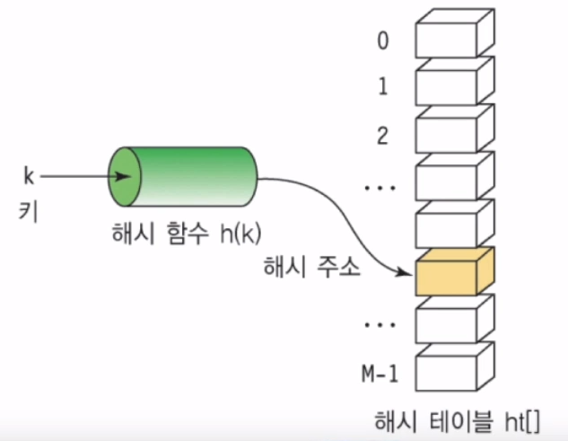</img>

### Division 기법
- 가장 간단한 해쉬 함수 구현 방식
- 나누기를 통한 나머지 값을 사용하는 기법
### 해쉬 테이블의 장단점과 주요 용도
- 장점
    - 데이터 저장/읽기 속도가 빠름 (검색속도)
    - 해쉬는 키에 대한 데이터가 중복되는지 확인이 쉬움
- 단점
    - 일반적으로 저장공간이 좀 더 많이 필요함
    - 여러 키에 해당하는 주소가 동일할 경우 충돌을 해결하기 위한 별도의 자료구조나 알고리즘이 필요함
- 주요 용도
    - 검색이 많이 필요한 경우
    - 저장, 삭제, 읽기가 비번한 경우
    - 캐쉬 구현 시 (중복 확인이 쉽기 때문)
### 충돌 (Collision) 해결 알고리즘
- 해쉬 테이블의 가장 큰 문제는 충돌
- 이 문제를 충돌 (Collision) 또는 해쉬 충돌 (Hash Collision)이라 부름
#### Chaining 기법
- 개방 해슁 또는 Open Hashing 기법 중 하나
    - 해쉬 테이블 저장공간 외의 공간을 활용하는 기법
- 충돌이 일어나면 링크드 리스트 자료 구조를 사용해서 데이터를 추가로 뒤에 연결시켜 저장하는 기법
#### Linear Probing 기법
- 폐쇄 해슁 또는 CloseHashing 기법 중 하나
    - 해쉬 테이블 저장공간 안에서 충돌 문제를 해결하는 기법
- 충돌이 일어나면 해당 Hash Address의 다음 Address부터 맨 처음 나오는 빈공간에 저장하는 기법
    - 저장 공간 활용도를 높이기 위한 기법
### 시간 복잡도
- 일반적인 경우 (충돌이 없는 경우) O(1)
- 최악의 경우 (충돌이 모두 일어난 경우) O(N)
- 일반적인 경우를 기대하고 만들기 때문에 시간 복잡도는 O(1)이라 말할 수 있음

## 트리 (Tree)
- Node와 Branch를 이용해서 사이클을 이루지 않도록 구성한 데이터 구조
- 트리 중 이진 트리 (Binary Tree) 형태의 구조로, 탐색(검색) 알고리즘 구현을 위해 많이 사용됨

### 용어
- Node: 트리에서 데이터를 저장하는 기본 요소 (데이터와 다른 연결된 노드에 대한 Breanch 정보 포함)
- Root Node: 최상위 노드
- Level: 최상위 노드를 Level 0으로 하였을 때, 하위 간선으로 연결된 노드의 길이
- Parent Node: 부모 노드. 어떤 노드의 다음 레벨이 연결된 노드
- Child Node: 자식 노드. 어떤 노드의 사위 레벨에 연결된 노드
- Leaf Node (Terminal Node): 자식 노드가 없는 노드
- Sibling (Brother Node): 형제 노드. 동일한 부모 노드를 가진 노드
- Depth: 트리에서 노드가 가질 수 있는 최대 Level

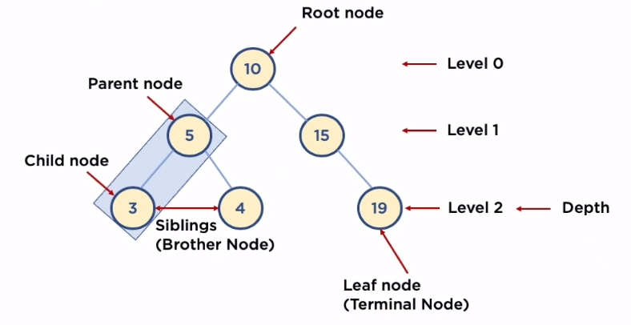</img>

### 이진 트리와 이진 탐색 트리 (Binary Search Tree)
- 이진 트리: 노드의 최대 간선이 2인 트리
- 이진 탐색 트리: 이진 트리에 다음과 같은 추가적인 조건이 있는 트리
    - 왼쪽 노드는 부모 노드보다 작은 값, 오른쪽 노드는 부모노드보다 큰 값을 가짐
### 이진 탐색 트리의 장점과 주요 용도
- 장점
    - 탐색 속도를 개선할 수 있음
- 단점
    - 트리가 한쪽으로 치워져 진다면 기대값이 O(logn)의 시간복잡도가 아닌 링크드 리스트와 동일한 O(n)의 성능을 보여줌
- 주요 용도
    - 데이터 검색 (탐색)
### 이진 탐색 트리의 삭제
#### Leaf Node 삭제
- 삭제될 노드의 부모 노드가 삭제될 노드를 가리키지 않도록 한다.

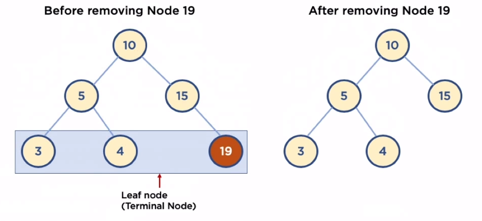</img>

#### 자식 노드가 하나인 노드 삭제
- 삭제될 노드의 부모 노드가 삭제될 노드의 자식 노드를 가리키도록 한다.

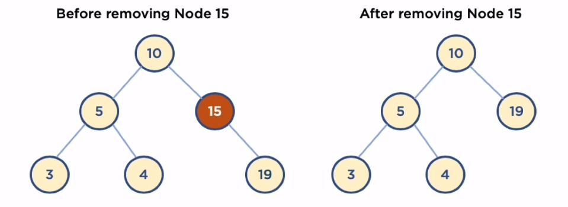</img>

#### 자식 노드가 두개인 노드 삭제
- 방법 1. 삭제될 노드의 오른쪽 자식 중 가장 작은 값을 삭제될 노드의 부모 노드가 가리키도록 한다.
- 방법 2. 삭제될 노드의 왼쪽 자식 중 가장 큰 값을 삭제될 노드의 부모 노드가 가리키도록 한다.

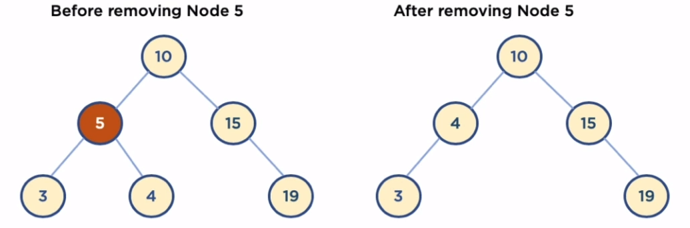</img>

### 시간 복잡도
- depth (트리의 높이)를 h라고 표기한다면 O(h)
- n개의 노드를 가진다면 h = logn에 가까우므로 시간 복잡도는 O(logn)
    - 한번 실행시마다 반씩 줄여나가므로 50%의 실행시간을 단축시킬 수 있음
    - 균형 잡힌 이진 트리의 경우

## 힙 (Heap)
- 트리 기반의 변형된 구조
- 데이터에서 최댓값과 최솟값을 빠르게 찾기 위해 고안된 완전 이진 트리(Complete Binary Tree)
    - 완전 이진 트리: 노드를 삽입할 때 최하단 왼쪽 노드부터 차례대로 삽입하는 트리
### 힙을 사용하는 이유
- 배열에 데이터를 넣고 최댓값과 최솟값을 찾으려면 O(n)이 걸림
- 이에 반해, 힙에 데이터를 넣고 최댓값과 최솟값을 찾으면 O(logn)이 걸림
- 우선순위 큐와 같이 최댓값과 최솟값을 빠르게 찾아야하는 자료구조 및 알고리즘 구현 등에 활용됨
### 힙 (Heap) 구조
- 힙은 최댓값을 구하기 위한 구조 (최대 힙, Max Heap)와 최솟값을 구하기 위한 구조 (최소 힙, Min Heap)로 분류됨
- 힙은 다음과 같이 두가지 조건을 가지고 있는 자료구조
    1. 각 노드의 값은 해당 노드의 자식 노드가 가진 값보다 크거나 같음 (최대 힙의 경우)
        - 최소 힙의 경우 각 노드의 값은 해당 노드의 자식 노드가 가진 값보다 작거나 같음
    2. 완전 이진 트리 형태를 가짐
### 힙과 이진 탐색 트리의 공통점과 차이점
- 공통점
    - 모두 이진 트리
- 차이점
    - 힙은 각 노드의 값이 자식노드보다 크거나 같음 (최대힙의 경우)
    - 이진 탐색 트리는 왼쪽 자식노드의 값이 가장 작고, 그 다음 부모 노드 그 다음 오른쪽 자식 노드 값이 가장 큼
    - 힙은 이진 탐색 트리의 조건인 자식노드에서 작은 값은 왼쪽, 큰 값은 오른쪽이라는 조건이 없음
        - 힙은 왼쪽 및 오른쪽 자식 노드의 값은 오른쪽이 클 수도, 왼쪽이 클 수도 있음
    - 이진 탐색 트리는 탐색을 위한 구조
    - 힙은 최댓/최솟값 검색을 위한 구조
### 힙 (Heap) 구현
- 일반적으로 힙 구현시 배열 자료구조를 활용
- 배열은 인덱스가 0번부터 시작하지만 힙 구현의 편의를 위해 Root 노드 인덱스 번호를 1로 지정하면 구현이 좀더 수월
#### 데이터 삽입
- 삽입할 데이터가 루트 데이터볻 클 경우 (최대 힙의 경우)
    - 먼저 삽입된 데이터는 완전 이진 트리 구조에 맞추어 삽입
    - 부모 노드보다 값이 클 경우 부모노드와 위치를 바꿔주는 작업을 반복
#### 특정 노드 위치 
- 부모 노드 인덱스 번호: 자식 노드 인덱스 번호 / 2
- 왼쪽 자식 노드 인덱스 번호: 부모 노드 인덱스 번호 * 2
- 오른쪽 자식 노드 인덱스 번호: 부모 노드 인덱스 번호 * 2 + 1
#### 데이터 삭제
- 보통 삭제는 최상단 노드와 최하단 마지막 노드를 바꿔줌
- 최상단으로 올라온 최하단 마지막 노드와 자식 노드를 비교하며 가장 큰 값을 최상단으로 바꿔주는 작업 반복
### 시간 복잡도
- n개의 노드를 가지는 Heap에 데이터 삽입 또는 삭제 시, 최악의 경우 root노드에서 leaf노드까지 비교해야 하므로 시간복잡도는 O(logn)

## 그래프 (Graph)
- 실제 세계의 현상이나 사물을 정점 (Vertex) 또는 노드 (Node)와 간선 (Edge)로 표현하기 위해 사용
### 용어
- 노드 (Node): 위치를 말함. 정점 (Vertex)라고도 함
- 간선 (Edge): 위치 간의 관계를 표시한 선으로 노드를 연결한 선이라 할 수 있음 (link 또는 branch라고도 함)
- 인접 정점 (Adjacent Vertex): 간선으로 직접 연결된 정점 (또는 노드)
- 참고 용어
    - 정점의 차수 (Degree): 무방향 그래프에서 하나의 정점에 인접한 정점의 수
    - 진입 차수 (In-Degree): 방향 그래프에서 외부에서 오는 간선의 수
    - 진출 차수 (Out-Degree): 방향 그래프에서 외부로 향하는 간선의 수
    - 경로 길이 (Path Length): 경로를 구성하기 위해 사용된 간선의 수
    - 단순 경로 (Simple Path): 처음 정점과 끝 정점을 제외하고 중복된 정점이 없는 경로
    - 사이클 (Cycle): 단순 경로의 시작 정점과 종료 정점이 동일한 경우
### 그래프 (Graph) 종류
#### 무방향 그래프 (Undirected Graph)
- 방향이 없는 그래프
- 간선을 통해 노드는 양방향으로 갈 수 있음
- 보통 노드 A, B가 연결되어 있을 경우 (A,B) 또는 (B,A)로 표기

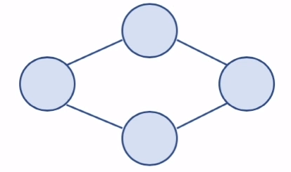</img>

#### 방향 그래프 (Directed Graph)
- 간선에 방향이 있는 그래프
- 보통 A,B가 A->B로 가는 간선으로 연결되어 있을 경우 <A, B>로 표기
    - <B, A>는 B->A로 가는 간선이 있는 경우이므로 <A, B>와 다름

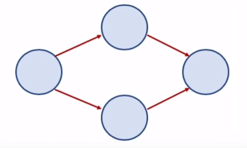</img>

#### 가중치 그래프 (Weighted Graph) 또는 네트워크 (Network)
- 간선에 비용 또는 가중치가 할당된 그래프

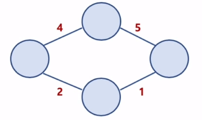</img>

#### 연결 그래프 (Connected Graph)와 비연결 그래프 (Disconnected Graph)
- 연결 그래프
    - 무방향 그래프에 있는 모든 노드에 대해 항상 경로가 존재하는 경우
- 비연결 그래프
    - 무방향 그래프에서 특정 노드에 대해 경로가 존재하지 않는 경우

    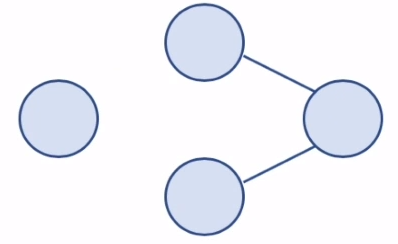</img>

#### 사이클 (Cycle)과 비순환 그래프 (Acyclic Graph)
- 사이클
    - 단순 경로의 시작 노드와 종료 노드가 동일한 경우
- 비순환 그래프
    - 사이클이 없는 그래프

    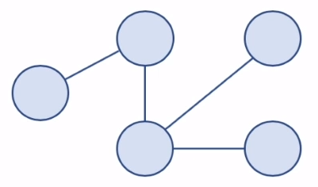</img>

#### 완전 그래프 (Complete Graph)
- 그래프의 모든 노드가 서로 연결되어 있는 그래프

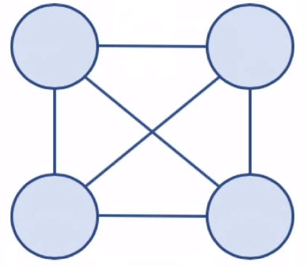</img>

### 그래프와 트리의 차이
- 트리는 그래프 자료구조 안에 속한 특별한 종류라고 볼 수 있음
- 정의
    - 그래프: 노드와 노드를 연결하는 간선으로 표현되는 자료구조
    - 트리: 그래프의 한종류. 방형성이 있는 비순환 그래프
- 방향성
    - 그래프: 방향 그래프, 무방향 그래프 둘다 존재
    - 트리: 방향 그래프만 존재
- 사이클
    - 그래프: 사이클 가능. 순환 및 비순환 그래프 모두 존재
    - 트리: 비순환 그래프로 사이클이 존재하지 않음
- 루트 노드
    - 그래프: 루트 노드가 존재하지 않음
    - 트리: 루트 노드가 존재
- 부모/자식 관계
    - 그래프: 부모 자식 개념이 존재하지 않음
    - 트리: 부모 자식 관계가 존재